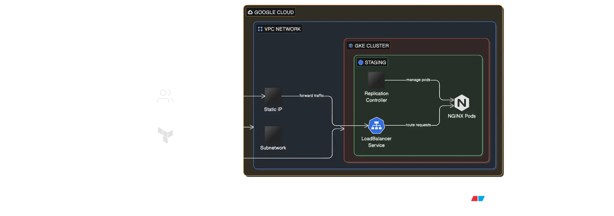

# Hands of Labs Practice: Kubernetes Load Balancer with Terraform

This project demonstrates deploying a **Kubernetes cluster** on Google Cloud using **Terraform**, along with a **LoadBalancer service** running a sample application.

## Features
- Provision GKE cluster using Terraform
- Configure network, subnetwork, and static IP
- Deploy a namespace, replication controller, and a LoadBalancer service
- Output the public IP of the service

## Tech Stack
- Terraform
- Google Kubernetes Engine (GKE)
- Kubernetes Services (LoadBalancer)
- Docker (nginx / custom container)

## Getting Started
1. Clone the repository
2. Run `terraform init`
3. Configure variables in `terraform apply -var="region=us-central1" -var="location=us-central1-a"`
4. Access your app via the output `load-balancer-ip`

## Demo

Live endpoint: `http://YOUR_LOAD_BALANCER_IP`

## Why this project matters
This project shows practical DevOps skills:
- Infrastructure as Code (Terraform)
- Kubernetes orchestration
- Cloud networking and LoadBalancer management

---
*This project is a personal practice lab for professional development.*
